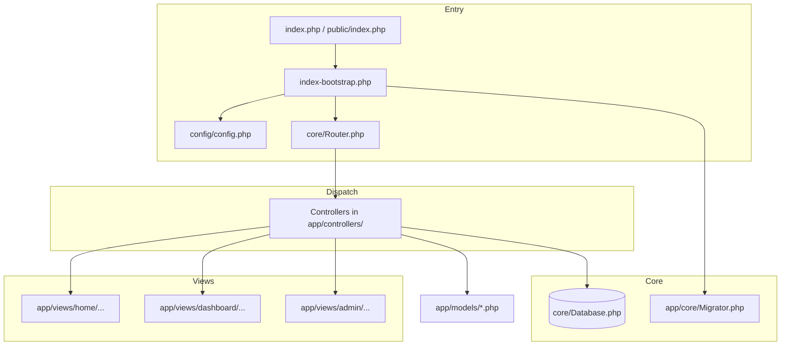
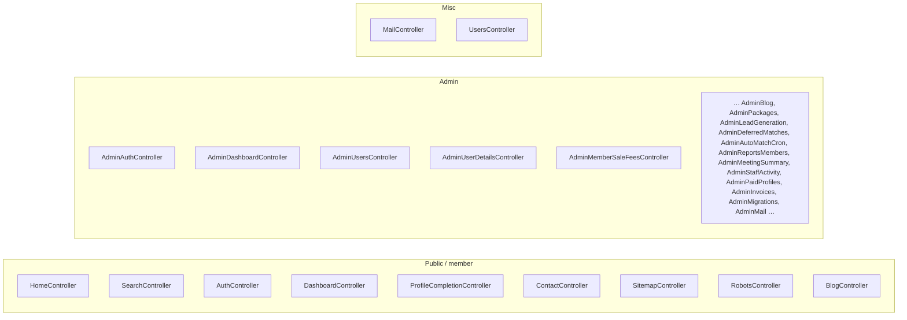
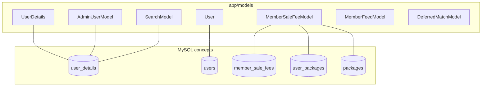
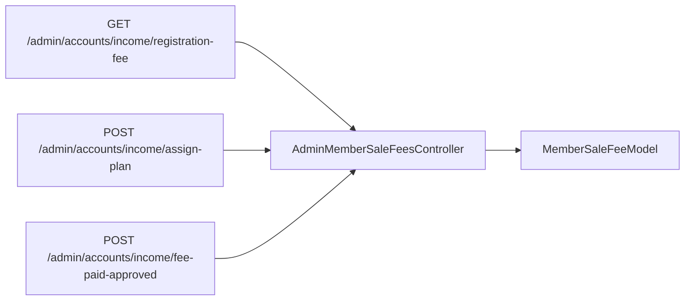

# AI change history and project graph (Wedding / admin matrimonial app)

**Purpose:** Give future AI sessions (and humans) a single place to see how the PHP app is wired and what changed over time. **Append** new rows to [Change log](#change-log) after meaningful edits; keep graphs in sync when architecture shifts.

**Entry points:** `index.php` (root), `public/index.php` — both should define `APP_ROOT` and include `index-bootstrap.php`.

---

## 1. Request graph (router → controller)

Edges mean “route dispatches to” or “includes”.

---

## 2. Controller nodes (names only; see `index-bootstrap.php` for URLs)

---

## 3. Data / domain links (models ↔ concerns)

Not every table is listed; this maps **where logic tends to live**.

**FK note (production):** `user_packages.user_id` references `users.id`. Registration often creates `user_details` only; `MemberSaleFeeModel::ensureUsersRowForUserDetailsId()` inserts a matching `users` row when assigning a package so inserts do not violate FK.

---

## 4. Accounts → Income → Registration fee (admin flow)

**Redirect policy:** Successful approve / assign-plan should return to **Accounts → Income** (`/admin/accounts/income/registration-fee` or `…/rishta-fee`), not only Reports → Payments.

---

## 5. Helpers and cross-cutting files (often touched by AI)

| Node / file | Role |
|-------------|------|
| `app/helpers/upload_storage.php` | `app_public_uploads_dir()` → project root `uploads/` |
| `app/helpers/cloudflare_security.php` | Optional CF / security headers |
| `app/helpers/profile_pdf_template.php` | PDF profile rendering, image data URIs |
| `public_url_for_path()` | Relative paths under `uploads/` become public URLs `/upload/…` (not `/public/uploads/` or `/uploads/`); disk unchanged |
| `.htaccess` (root + `public/`) | Rewrite, `/uploads` alias |
| `index-bootstrap.php` | All route definitions |

---

## Change log

Append-only. Use ISO date, short title, files touched, behavior.

| Date | Area | Summary | Key files |
|------|------|---------|-----------|
| 2026-04-04 | Income / FK | Ensure `users` row exists before `user_packages` insert; soften FK error copy | `app/models/MemberSaleFeeModel.php` |
| 2026-04-04 | Income / UX | After approve / assign-plan, redirect to Accounts → Income registration or rishta fee list | `app/controllers/AdminMemberSaleFeesController.php` |
| 2026-04-04 | Docs | Added this graph + change log file | `docs/AI_CHANGE_HISTORY_AND_GRAPH.md` |
| 2026-04-04 | Admin / Profile PDF | Load same merged row as profile view (`getUserListSupplement`); no-store headers; profile image uses `admin_member_first_upload_relative_path` + `/admin/users/member-photo` when local; education JSON/plain; work line combines occupation, designation, employed_in, work_detail; age from robust DOB parse; married siblings show DB text labels (not `(int)` on phrases) | `app/controllers/AdminUsersController.php`, `app/helpers/profile_pdf_template.php`, `app/views/partials/profile_pdf_card.php` |
| 2026-04-04 | Admin / Users list | Fix `</main>` / `admin-main` closing order (match other admin pages); expose `window.submitBulkStatus` so bulk Approved / Unapproved / Suspended POST works reliably | `app/views/admin/users.php` |
| 2026-04-04 | Admin / Income fee list | Dynamic bulk status POST to `/admin/users/bulk-status` now includes `csrf_token` (controller requires it) | `app/views/admin/income_fee_members.php` |
| 2026-04-04 | Public URLs / uploads | Generated image URLs use `/upload/…` instead of `/uploads/…` or `/public/uploads/…` (`public_url_for_path`); `.htaccess` maps `/upload/` to project `uploads/`; blog + paid-profiles hardcoded paths updated | `app/helpers/public_url.php`, `.htaccess`, `public/.htaccess`, `app/helpers/upload_storage.php`, `app/views/blog/index.php`, `app/views/blog/detail.php`, `app/controllers/AdminBlogController.php`, `app/views/admin/paid-profiles.php` |
| 2026-04-04 | Public profile / PDF card image | `profile_pdf_template_compute_vars()` only uses `/admin/users/member-photo` when `$preferAdminMemberPhotoProxy` is true (admin PDF). Public `/profile/{id}` and member feed use public `/upload/…` or data URIs — guests cannot load the admin-only photo endpoint | `app/helpers/profile_pdf_template.php`, `app/views/partials/profile_pdf_card.php`, `app/views/home/frontend/profile_view.php`, `app/views/admin/profile_pdf_template.php`, `app/views/dashboard/feed-view.php`, `app/controllers/DashboardController.php` |

---

## How to update this document

1. After a feature or fix that affects routes, models, or admin flows, add one **Change log** row.
2. If you add a major new controller or route group, extend the Mermaid diagrams (keep them readable; prefer small subgraphs).
3. Do not delete old log rows; archive by date if the app is forked.
